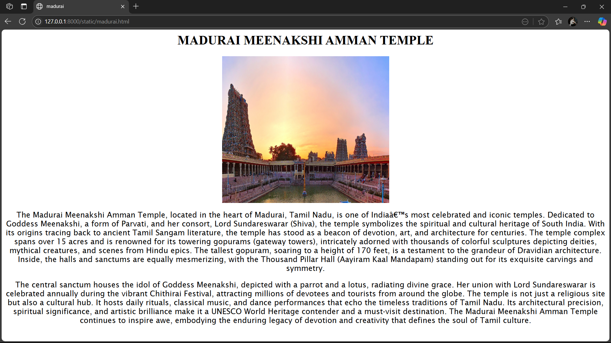
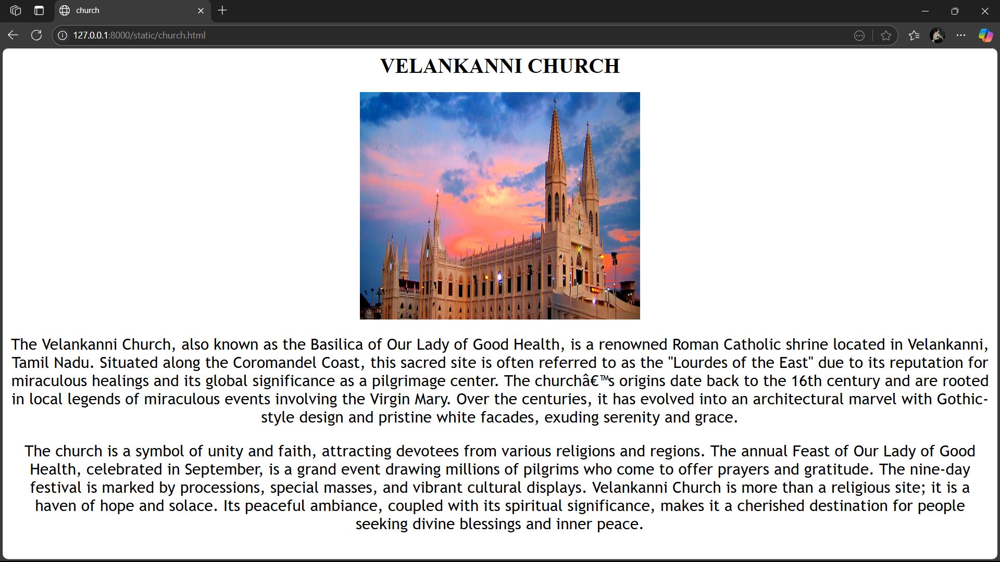
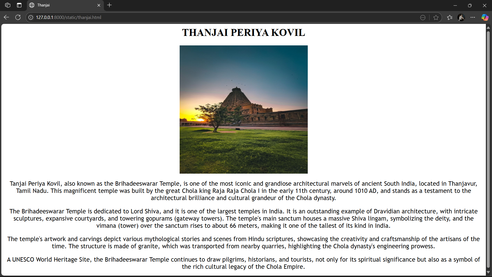
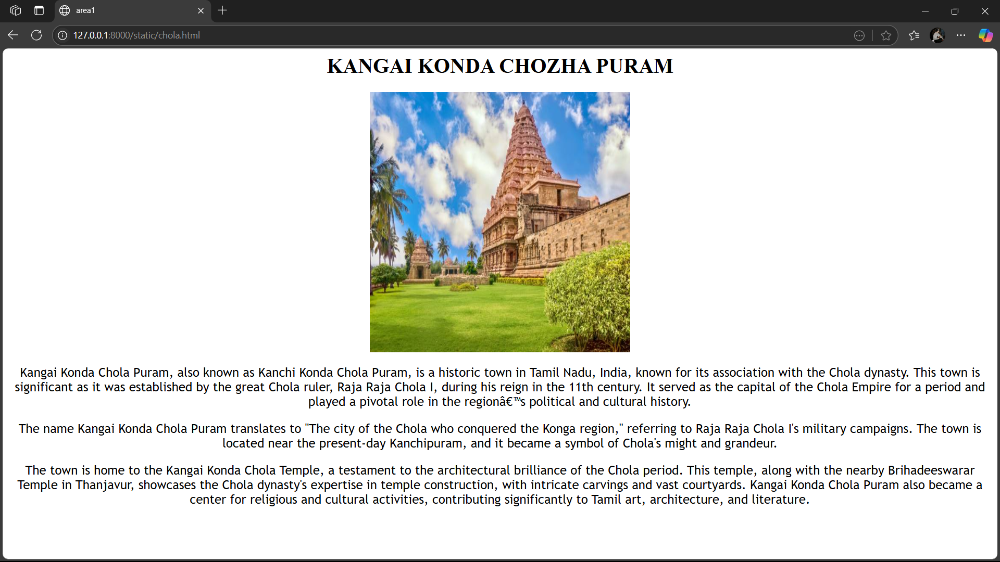

# Ex04 Places Around Me
# Date: 28-10-2024
# AIM
To develop a website to display details about the places around my house.

# DESIGN STEPS
## STEP 1
Create a Django admin interface.

## STEP 2
Download your city map from Google.

## STEP 3
Using <map> tag name the map.

## STEP 4
Create clickable regions in the image using <area> tag.

## STEP 5
Write HTML programs for all the regions identified.

## STEP 6
Execute the programs and publish them.

# CODE
```
<html>
   <head>
        <title>image map</title>
</head>

   <body><center>
    
<map name="my-map">
        <area shape="rect" coords="50,50,150,150" href="chola.html" alt="Area 1">
        <area shape="circle" coords="300,200,50" href="hotal.html" alt="Area 2">
        <area shape="poly" coords="400,50,450,100,400,150,350,100" href="thanjai.html" alt="Area 3">
        <area shape="poly6" coords="637,314,681,352,717,322,678,286" href="madurai.html" alt="Area 4">
        <area shape="rect" coords="129,340,179,380" href="church.html" alt="Area 5">
      </map></center> 
</body>
</html>
```


```
<html>
    <head>
        <title>church</title>
    </head>
    <body><center>
    <h1>VELANKANNI CHURCH</h1>
    
    <p style="font-family: 'Trebuchet MS', 'Lucida Sans Unicode', 'Lucida Grande', 'Lucida Sans', Arial, sans-serif; font-size:x-large ;">
        The Velankanni Church, also known as the Basilica of Our Lady of Good Health, is a renowned Roman Catholic shrine located in Velankanni, Tamil Nadu. Situated along the Coromandel Coast, this sacred site is often referred to as the "Lourdes of the East" due to its reputation for miraculous healings and its global significance as a pilgrimage center.
        
        The church’s origins date back to the 16th century and are rooted in local legends of miraculous events involving the Virgin Mary. Over the centuries, it has evolved into an architectural marvel with Gothic-style design and pristine white facades, exuding serenity and grace.</p>
    <p  style="font-family: 'Trebuchet MS', 'Lucida Sans Unicode', 'Lucida Grande', 'Lucida Sans', Arial, sans-serif; font-size:x-large ;"> The church is a symbol of unity and faith, attracting devotees from various religions and regions. The annual Feast of Our Lady of Good Health, celebrated in September, is a grand event drawing millions of pilgrims who come to offer prayers and gratitude. The nine-day festival is marked by processions, special masses, and vibrant cultural displays.

        Velankanni Church is more than a religious site; it is a haven of hope and solace. Its peaceful ambiance, coupled with its spiritual significance, makes it a cherished destination for people seeking divine blessings and inner peace.</p>
    </body></center>
</html>
```


```
<html>
    <head>
        <title>madurai</title>
    </head>
    <body><center>
        <h1>MADURAI MEENAKSHI AMMAN TEMPLE</h1>
        
         <p style="font-family: 'Lucida Sans', 'Lucida Sans Regular', 'Lucida Grande', 'Lucida Sans Unicode', Geneva, Verdana, sans-serif; font-size: larger;">The Madurai Meenakshi Amman Temple, located in the heart of Madurai, Tamil Nadu, is one of India’s most celebrated and iconic temples. Dedicated to Goddess Meenakshi, a form of Parvati, and her consort, Lord Sundareswarar (Shiva), the temple symbolizes the spiritual and cultural heritage of South India. With its origins tracing back to ancient Tamil Sangam literature, the temple has stood as a beacon of devotion, art, and architecture for centuries.

            The temple complex spans over 15 acres and is renowned for its towering gopurams (gateway towers), intricately adorned with thousands of colorful sculptures depicting deities, mythical creatures, and scenes from Hindu epics. The tallest gopuram, soaring to a height of 170 feet, is a testament to the grandeur of Dravidian architecture. Inside, the halls and sanctums are equally mesmerizing, with the Thousand Pillar Hall (Aayiram Kaal Mandapam) standing out for its exquisite carvings and symmetry.</p>
          <p style="font-family: 'Lucida Sans', 'Lucida Sans Regular', 'Lucida Grande', 'Lucida Sans Unicode', Geneva, Verdana, sans-serif; font-size: larger;"> The central sanctum houses the idol of Goddess Meenakshi, depicted with a parrot and a lotus, radiating divine grace. Her union with Lord Sundareswarar is celebrated annually during the vibrant Chithirai Festival, attracting millions of devotees and tourists from around the globe.

            The temple is not just a religious site but also a cultural hub. It hosts daily rituals, classical music, and dance performances that echo the timeless traditions of Tamil Nadu. Its architectural precision, spiritual significance, and artistic brilliance make it a UNESCO World Heritage contender and a must-visit destination.
            
            The Madurai Meenakshi Amman Temple continues to inspire awe, embodying the enduring legacy of devotion and creativity that defines the soul of Tamil culture.</p>  
            
 </body></center>
</html>
```


```
<html>
    <head>
        <title>area1</title>
    </head>
    <body><center>
        <h1>KANGAI KONDA CHOZHA PURAM</h1>
        
    <p style="font-family:'Trebuchet MS', 'Lucida Sans Unicode', 'Lucida Grande', 'Lucida Sans', Arial, sans-serif ; font-size: larger;">Kangai Konda Chola Puram, also known as Kanchi Konda Chola Puram, is a historic town in Tamil Nadu, India, known for its association with the Chola dynasty. This town is significant as it was established by the great Chola ruler, Raja Raja Chola I, during his reign in the 11th century. It served as the capital of the Chola Empire for a period and played a pivotal role in the region’s political and cultural history.</p>
    <p style="font-family: 'Trebuchet MS', 'Lucida Sans Unicode', 'Lucida Grande', 'Lucida Sans', Arial, sans-serif ; font-size: larger;">The name Kangai Konda Chola Puram translates to "The city of the Chola who conquered the Konga region," referring to Raja Raja Chola I's military campaigns. The town is located near the present-day Kanchipuram, and it became a symbol of Chola's might and grandeur.</p>
    <p style="font-family:'Trebuchet MS', 'Lucida Sans Unicode', 'Lucida Grande', 'Lucida Sans', Arial, sans-serif; font-size: larger;">The town is home to the Kangai Konda Chola Temple, a testament to the architectural brilliance of the Chola period. This temple, along with the nearby Brihadeeswarar Temple in Thanjavur, showcases the Chola dynasty's expertise in temple construction, with intricate carvings and vast courtyards. Kangai Konda Chola Puram also became a center for religious and cultural activities, contributing significantly to Tamil art, architecture, and literature.</p>
</body></center>
</html>
```

# OUTPUT
#









#
# RESULT
The program for implementing image maps using HTML is executed successfully.
